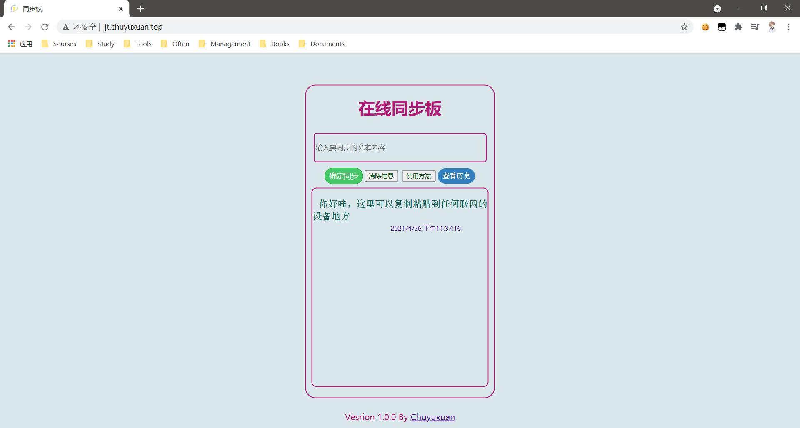
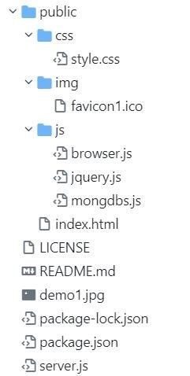

# Clip Board

## 简介
基于B/S架构，多端同步在线网络剪贴板，解决跨设备剪贴文本内容问题。
演示地址：[jt.chuyuxuan.top](jt.chuyuxuan.top)



## 技术栈
+ Node.js
+ Express.js
+ MongoDB
+ jQuery.js
+ Sokect.io

## 项目结构



## 项目使用方法

```shell
git clone https://github.com/Chuyuxuan0v0/clipboard.git

cd clipboard

npm i

node server.js
```

在`127.0.0.1:9000`访问即可。

## 将要完善的需求
+ [ ] 使用Vue作为前端  
+ [ ] 支持一键复制功能
+ [ ] 私人剪贴板
+ [ ] 支持图片剪贴
